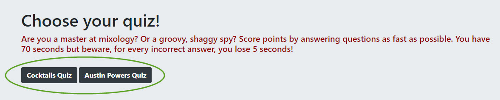
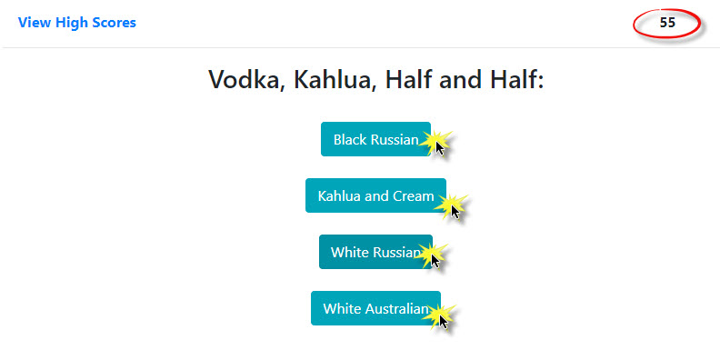
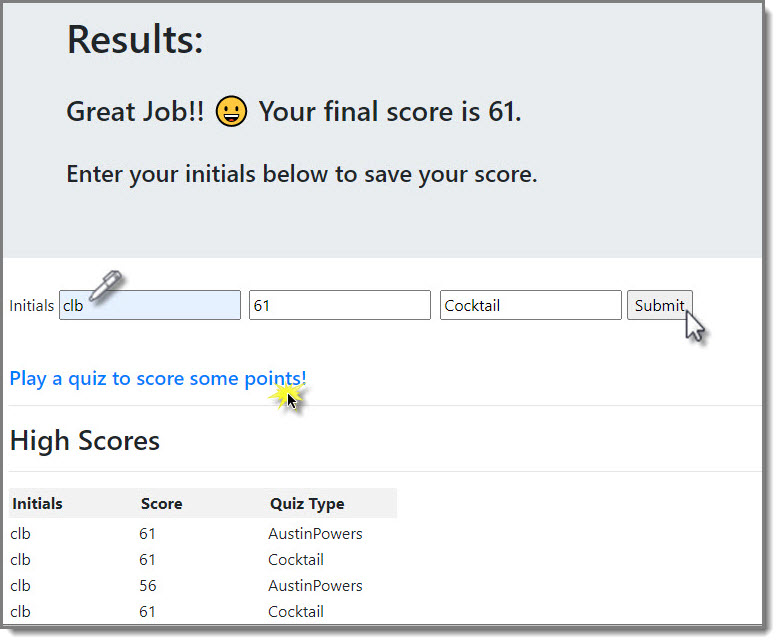

# Test Your Knowledge
### Unit 04 Homework: Web APIs - Create a Quiz

### TOC
* [Overview](#overview)
* [Application](#application)
* [Usage](#usage)
* [License](#license)

## Overview
Time to test your knowledge! Choose between a Cocktail quiz or an Austin Powers quiz. You have 70 seconds to answer 7 questions. If you answer a question incorrectly you will loose additional time. Once you finish the quiz, you will be taken to the High Scores page where you can enter your initials to record your score. You have the ability to clear your scores as well if you want to start over. Good luck and have fun!

## Application
* Access the repo here: https://github.com/cbayley-edu/test-your-knowledge
* Access the application here: https://cbayley-edu.github.io/test-your-knowledge/

## Usage
#### Choose your quiz...
   

#### Act quickly!  You have 70 seconds to complete the quiz.  Click on the correct answer.
#### If you answer incorrectly, you'll lose 5 seconds.  If you don't get through all of the questions in the time limit, the quiz will end.
   

#### Enter your initials to keep track of your scores! Click the clear button if you're too embarrassed.
   

#### Keep playing to beat your previous score and be sure to try both quizzes!

## License
MIT License

Copyright (c) 2020 Christina Bayley

Permission is hereby granted, free of charge, to any person obtaining a copy
of this software and associated documentation files (the "Software"), to deal
in the Software without restriction, including without limitation the rights
to use, copy, modify, merge, publish, distribute, sublicense, and/or sell
copies of the Software, and to permit persons to whom the Software is
furnished to do so, subject to the following conditions:

The above copyright notice and this permission notice shall be included in all
copies or substantial portions of the Software.

THE SOFTWARE IS PROVIDED "AS IS", WITHOUT WARRANTY OF ANY KIND, EXPRESS OR
IMPLIED, INCLUDING BUT NOT LIMITED TO THE WARRANTIES OF MERCHANTABILITY,
FITNESS FOR A PARTICULAR PURPOSE AND NONINFRINGEMENT. IN NO EVENT SHALL THE
AUTHORS OR COPYRIGHT HOLDERS BE LIABLE FOR ANY CLAIM, DAMAGES OR OTHER
LIABILITY, WHETHER IN AN ACTION OF CONTRACT, TORT OR OTHERWISE, ARISING FROM,
OUT OF OR IN CONNECTION WITH THE SOFTWARE OR THE USE OR OTHER DEALINGS IN THE
SOFTWARE.